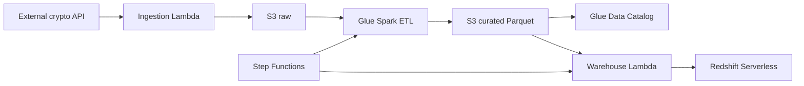

# Crypto Analytics Data Platform

A reference **cloud-native analytics data platform** for cryptocurrency price data on **AWS**. The system implements a **medallion-style pipeline**: raw landing in Amazon S3, curated Parquet datasets produced by **AWS Glue** (Apache Spark), and analytical serving in **Amazon Redshift Serverless**, with optional **AWS Step Functions** orchestration and **Amazon CloudWatch** observability hooks.

This repository is suitable as a **portfolio or internal starter** for teams building event or API-driven data products with clear separation between ingestion, transformation, and warehouse loading.

---

## Table of contents

- [Architecture overview](#architecture-overview)
- [Data flow](#data-flow)
- [Repository layout](#repository-layout)
- [Technology stack](#technology-stack)
- [Prerequisites](#prerequisites)
- [Configuration](#configuration)
- [Infrastructure (Terraform)](#infrastructure-terraform)
- [Application components](#application-components)
- [Operational notes](#operational-notes)
- [Security and compliance](#security-and-compliance)
- [Extending the platform](#extending-the-platform)
- [License](#license)

---

## Architecture overview

High-level components:

| Layer | Responsibility |
|--------|----------------|
| **Ingestion** | Scheduled or event-driven Lambda pulls market data from an HTTP API, validates payloads, partitions by time, and writes JSON to the **raw** zone in S3. |
| **Processing (ETL)** | AWS Glue job (PySpark) reads raw JSON, cleans and normalizes fields, adds Hive-style partitions, validates the DataFrame, and writes **curated** Parquet under a governed layout. |
| **Catalog** | AWS Glue Data Catalog database and external table describe curated Parquet for query engines and downstream tooling. |
| **Warehouse** | Lambda (or Step Functions–invoked Lambda) discovers the latest S3 partition, runs idempotent **COPY** into Redshift staging, merges into a fact table, records load metadata, and truncates staging. |
| **Orchestration** | Optional Lambdas start Glue; Step Functions can chain Glue job completion to the Redshift loader for ordered, auditable runs. |
| **Observability** | CloudWatch log group for Glue and a metric alarm scaffold for failed Glue tasks. |



---

## Data flow

1. **Raw zone** — JSON objects land under a time-based prefix (for example `raw/year=…/month=…/day=…/`) produced by `ingestion/services/partitioning.py` and `ingestion/services/s3_writer.py`.
2. **Curated zone** — The Glue script (`etl/glue_job.py`) reads from `s3://…/raw/`, applies schema (`etl/schema/crypto_schema.py`), cleaning (`etl/transformations/cleaning.py`), normalization, partitioning (`etl/transformations/partitioning.py`), and writes Parquet to a path aligned with the Glue table (for example `curated/crypto_prices/` with partition columns).
3. **Redshift** — DDL in `warehouse/sql/ddl.sql` defines `crypto` schema, staging `stg_crypto_prices`, fact `fact_crypto_prices`, and `etl_metadata` for incremental loads. The loader (`warehouse/loader/incremental_loader.py`) uses **COPY … FORMAT AS PARQUET**, then a delete/insert pattern against the fact table, metadata recording, and staging truncate.

---

## Repository layout

```
crypto_analytics_data_platform/
├── etl/                    # AWS Glue PySpark job (local + uploaded script)
│   ├── glue_job.py         # Main ETL entrypoint
│   ├── schema/             # Spark StructType definitions
│   ├── services/           # Read / validate / write helpers
│   ├── transformations/    # Cleaning, normalization, partitions
│   └── requirements.txt    # e.g. pyspark for local dev
├── ingestion/              # API → S3 raw Lambda-oriented package
│   ├── lambda/ingest_crypto.py
│   ├── clients/, services/, validators/, config/
│   └── requirements.txt
├── warehouse/              # Redshift Serverless loader (Lambda handler + libs)
│   ├── lambda.py
│   ├── loader/, services/, sql/ddl.sql
│   └── requirements.txt
├── orchestration/          # Thin Lambdas to start Glue / loader
│   └── lambda/
│       ├── trigger_glue_job/app.py
│       └── trigger_redshift_loader/app.py
├── infrastructure/       # Terraform modules + env tfvars
│   ├── modules/            # s3, glue, lambda, iam, catalog, redshift, stepfunctions, observability
│   ├── environments/dev.tfvars
│   ├── variables.tf, outputs.tf, providers.tf
│   └── main.tf           # Compose modules here (see Infrastructure section)
└── builds/                 # Build artifacts (e.g. packaged Lambda); typically gitignored in production repos
```

---

## Technology stack

- **Language**: Python 3.11 (Lambda), PySpark on Glue 4.0  
- **Compute**: AWS Lambda, AWS Glue  
- **Storage**: Amazon S3 (versioning + SSE-S3 in module)  
- **Warehouse**: Amazon Redshift Serverless (namespace + workgroup)  
- **Metadata**: AWS Glue Data Catalog  
- **Orchestration**: AWS Step Functions (Glue `startJobRun.sync` → Lambda invoke)  
- **IaC**: Terraform (hashicorp/aws ~> 5.0)  
- **Libraries**: `requests`, `python-dotenv` (ingestion/warehouse), `boto3` (runtime / orchestration)

---

## Prerequisites

- **AWS account** with permissions to create S3, Glue, Lambda, IAM, Redshift Serverless, Step Functions, CloudWatch, Secrets Manager (for Redshift credentials as referenced by variables), and optionally EventBridge for schedules (not defined in modules by default).
- **Terraform** >= 1.0 and **AWS CLI** configured with a profile or environment credentials.
- **Python** 3.11+ for local packaging and tests (optional).
- **Docker** or a compatible Spark runtime if you run the Glue script locally against Spark (optional).

---

## Configuration

Configuration is environment-driven via **`.env`** (loaded with `python-dotenv` in `ingestion`, `etl`, and `warehouse` settings modules).

| Variable | Used by | Purpose |
|----------|---------|---------|
| `AWS_REGION` | Ingestion | AWS region for clients |
| `S3_BUCKET` | Ingestion, ETL (when wired), Warehouse | Data lake bucket name |
| `API_URL` | Ingestion | HTTP endpoint for price JSON |
| `REDSHIFT_DATABASE` | Warehouse | Redshift database name |
| `REDSHIFT_WORKGROUP` | Warehouse | Serverless workgroup name |
| `REDSHIFT_SECRET_ARN` | Warehouse | Secrets Manager ARN for auth |
| `REDSHIFT_COPY_ROLE` | Warehouse | IAM role ARN in `COPY` statement for S3 access |

**Orchestration** Lambdas expect `GLUE_JOB_NAME` where applicable (see `orchestration/lambda/trigger_glue_job/app.py`).

**Terraform** variables (see `infrastructure/variables.tf` and `infrastructure/environments/dev.tfvars`) include `region`, `bucket_name`, `redshift_db`, `redshift_workgroup`, and `redshift_secret`. Extend modules to pass ARNs and names consistently into Lambda environment blocks.

> **Alignment tip:** The Glue script currently references a bucket constant in code for paths; for production, drive `RAW_PATH` / `CURATED_PATH` from the same `S3_BUCKET` variable or Glue job parameters so Terraform, `.env`, and the job stay in sync.

---

## Infrastructure (Terraform)

Under `infrastructure/modules/`:

- **`s3`**: Data lake bucket with versioning and default encryption (AES-256).  
- **`glue`**: Glue job `crypto-etl-job` pointing at `s3://<bucket>/scripts/glue_etl.py`, job bookmarks enabled, metrics on.  
- **`iam`**: Glue service role with least-privilege S3 list/get/put on the configured bucket.  
- **`catalog`**: Glue database `crypto` and external table `crypto_prices` (Parquet, partitioned columns).  
- **`lambda`**: Redshift loader function with environment variables for workgroup, database, secret, and bucket (artifact path `lambda.zip` is a placeholder—replace with your deployment artifact).  
- **`redshift`**: Redshift Serverless namespace and workgroup.  
- **`stepfunctions`**: State machine `crypto-pipeline` running Glue then invoking the loader Lambda.  
- **`observability`**: Log group and example Glue failure alarm.

The **root** `infrastructure/main.tf` is the intended place to **wire modules** (pass `glue_role_arn`, `lambda_role_arn`, `stepfn_role_arn`, etc.). As shipped, modules are **decoupled building blocks**; compose them and add missing IAM policies (Lambda invocation from Step Functions, Redshift Data API, additional S3 paths) before applying to a live account.

**Typical workflow:**

1. Create backend/state as per your organization’s standard.  
2. Fill `infrastructure/environments/dev.tfvars` (and add secrets ARNs, role ARNs).  
3. Compose `main.tf` to instantiate modules and outputs.  
4. `terraform init && terraform plan -var-file=environments/dev.tfvars`  
5. Upload Glue script to `s3://<bucket>/scripts/glue_etl.py` (or adjust `script_location`).  
6. Build and upload `lambda.zip` for each Lambda.

---

## Application components

### Ingestion (`ingestion/`)

- **`lambda/ingest_crypto.py`**: Orchestrates fetch → validate → partition → write to S3.  
- **`clients/crypto_api_client.py`**: HTTP GET with timeout, JSON parse, UTC timestamp enrichment.  
- **`validators/payload_validator.py`**: Structural checks on the payload.  
- **`services/s3_writer.py`**, **`services/partitioning.py`**: Raw key layout and S3 write.

Deploy as a Lambda layer or zip with `ingestion` as the package root; set IAM for `s3:PutObject` on the raw prefix.

### ETL (`etl/`)

- **`glue_job.py`**: Spark session, read JSON with explicit schema, transform pipeline, write Parquet to curated.  
- Designed to run under **Glue 4.0** with job parameters or environment-specific bucket configuration.

### Warehouse (`warehouse/`)

- **`lambda.py`**: Lambda entry that calls `run_incremental_load()`.  
- **`loader/incremental_loader.py`**: Latest partition discovery, metadata deduplication, `COPY`, fact merge pattern, metadata insert, staging truncate.  
- **`services/redshift_client.py`**: Redshift Data API execution (async + wait).  
- **`sql/ddl.sql`**: Schema objects to run once per environment (manually or via migration tooling).

### Orchestration (`orchestration/`)

- **`trigger_glue_job`**: Starts a Glue job run by name from `GLUE_JOB_NAME`.  
- **`trigger_redshift_loader`**: Invokes the same incremental load path as the warehouse Lambda (useful from Step Functions or schedules).

---

## Operational notes

- **Idempotency**: Warehouse loading uses `etl_metadata` to skip already-loaded partitions; combine with Glue job bookmarks for incremental raw processing.  
- **Ordering**: Step Functions `startJobRun.sync` waits for Glue before Redshift load, reducing race conditions.  
- **Monitoring**: Extend CloudWatch alarms for Lambda errors, Step Functions failures, and Redshift Serverless metrics.  
- **Cost**: Redshift Serverless and Glue incur usage-based charges; S3 lifecycle policies (not included) are recommended for raw retention tuning.

---

## Security and compliance

- S3 module enables **encryption at rest** (SSE-S3) and **versioning**; consider **bucket policies**, **KMS CMKs**, and **VPC endpoints** for stricter networks.  
- Store database credentials in **Secrets Manager**; avoid plaintext in tfvars in shared repos—use CI secrets or Terraform Cloud variables.  
- Least-privilege IAM: separate roles for Glue, Lambda, Step Functions, and Redshift `COPY` with minimal S3 prefixes.  
- Enable **CloudTrail** and **S3 access logging** at the account level for audit trails (outside this repo’s minimal modules).

---

## Extending the platform

- Add **Amazon EventBridge** rules to schedule ingestion and/or Step Functions executions.  
- Introduce **data quality** (e.g. Deequ, Great Expectations) in Glue or pre-load checks.  
- Add **dbt** or **Redshift stored procedures** for semantic layers and marts.  
- Multi-source ingestion: generalize `crypto_api_client` into a plugin pattern and reuse the same raw layout contract.  
- **CI/CD**: GitHub Actions or GitLab CI to run `terraform validate`, unit tests, and publish versioned artifacts to S3.

---

## Author

Ahmed Abdelnasser

Backend & Data Engineer | AI Infrastructure Engineer | Python Engineer
